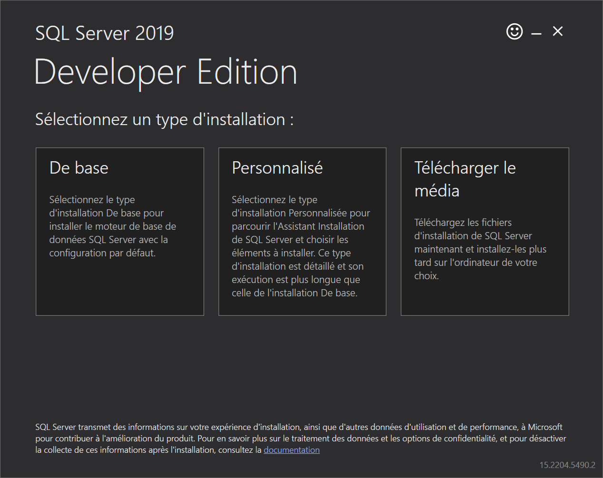
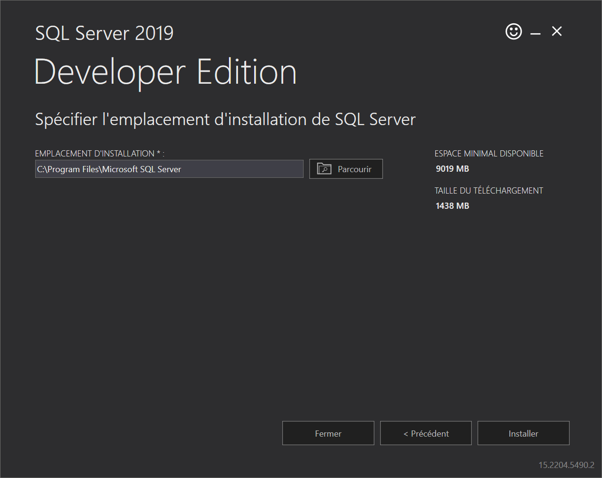
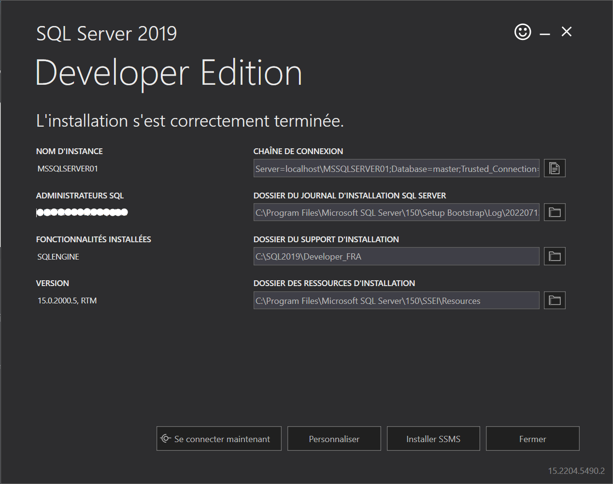

# Guide d'installation SQL Server Developper

1. Téléchargez l'installateur de SQL Server édition "Developer" à l'adresse suivante :  https://go.microsoft.com/fwlink/?linkid=866662

2. Exécutez l'installateur et choisissez l'installation de base

3. Acceptez la licence d'utilisation, puis spécifiez le répertoire d'installation si nécessaire.

4. Une fois l'installation terminée, conservez la connection string qui s'affiche à l'écran, elle sera utilisée pour connecté l'API à la base de donnée.

5. Vous pouvez également installer SSMS, le logiciel d'exploration de base de donnée SQL Server fournit par Microsoft.